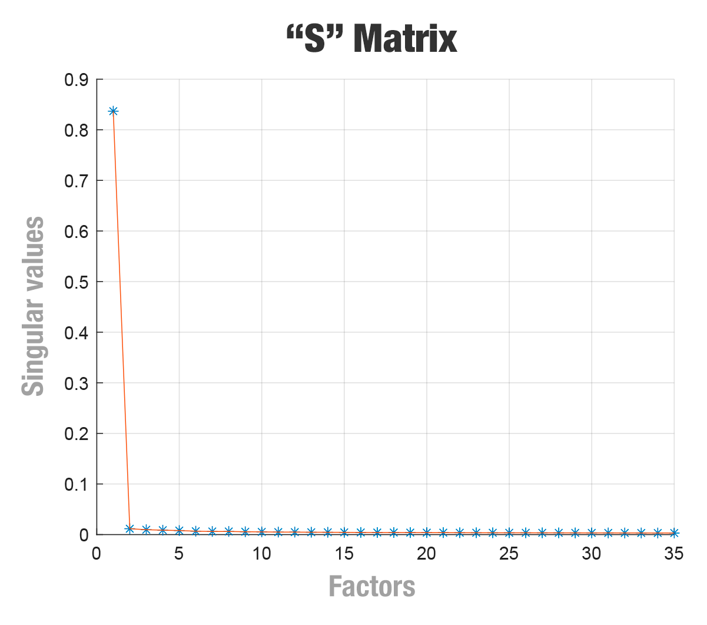
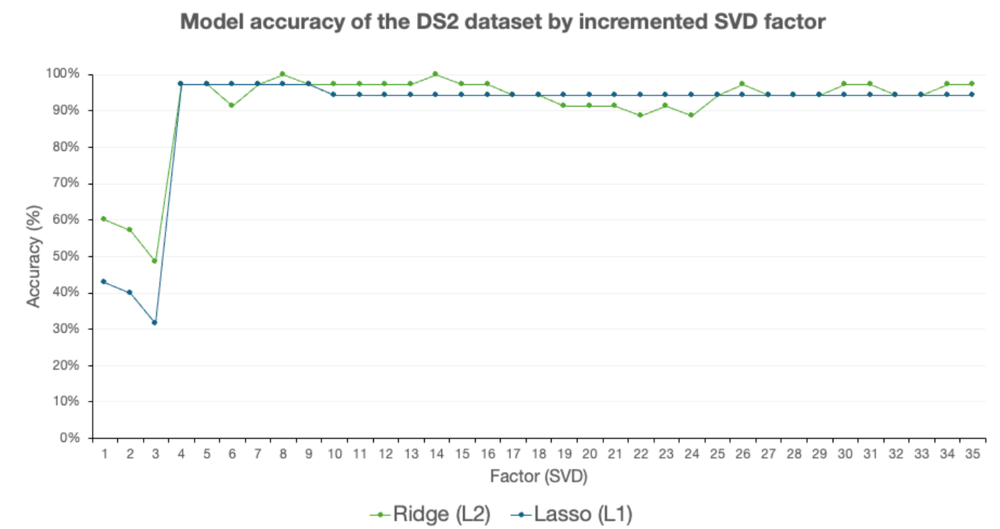
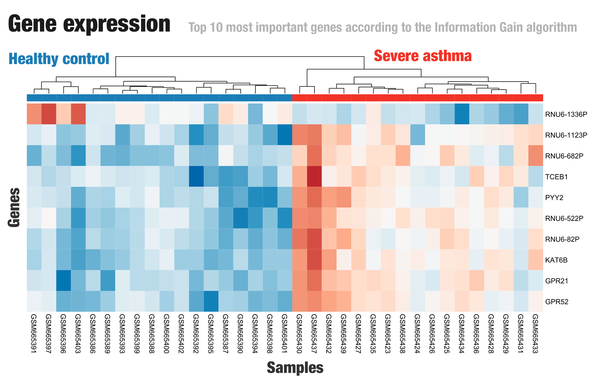
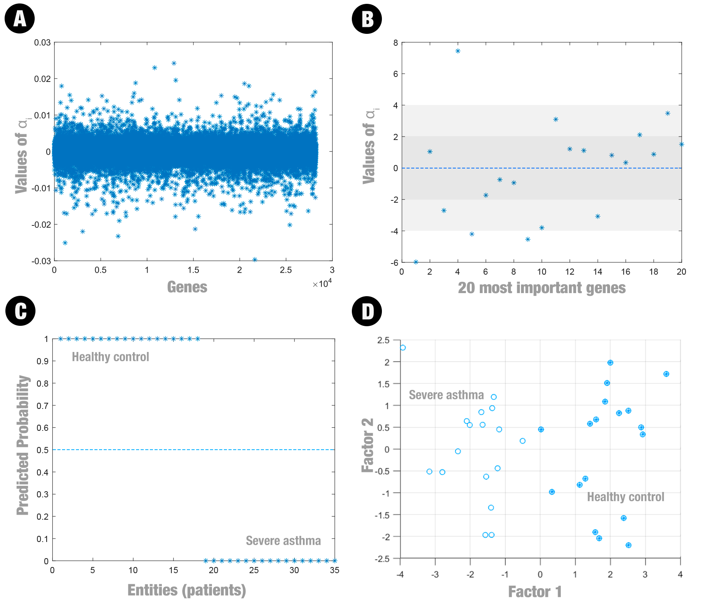
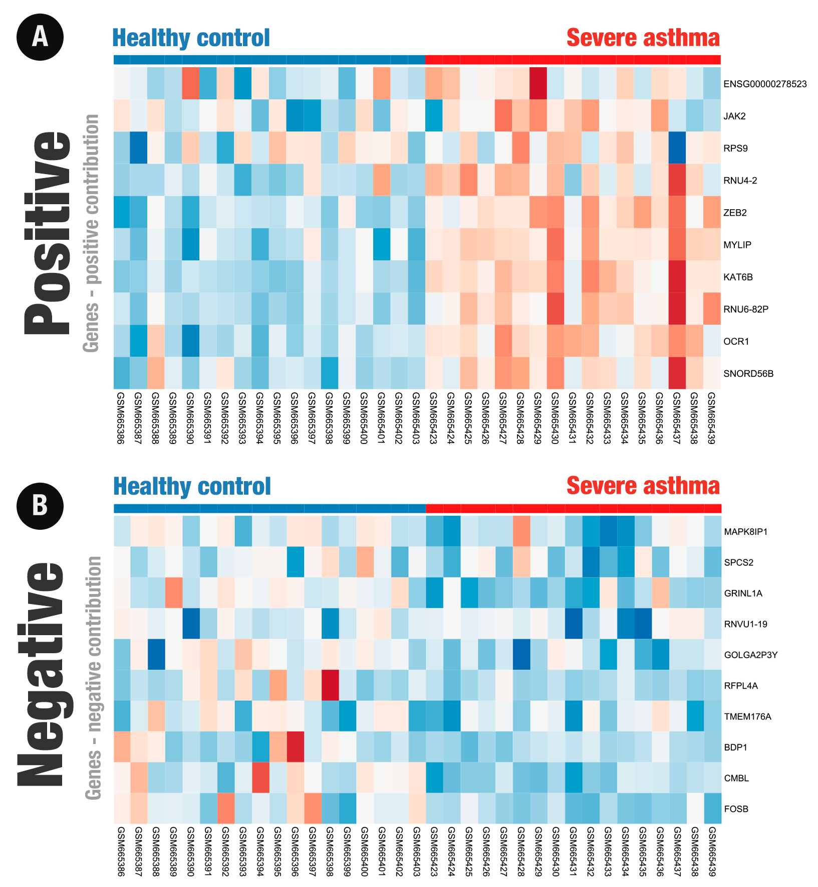

# Article images

## Figure 1. Importance of singular values by total factors (principal components)

## Figure 2. Accuracy of the model when each dimension resulting from the reduced matrix was introduced as input to the model

## Figure 3. Expression levels for the top 10 most important genes by the Information Gain algorithm. Values were normalized by row. Red cells: higher gene expression levels; blue cells: lower gene expression levels. Details are available at Supplementary Table S1

## Figure 4. (A) Projection of the Samples in Space of weight distribution (α) derived from the logistic regression model. (B) 20 genes that most positively (10) and negatively (10) impacted classification. (C) Classification Probabilities Obtained by Logistic Regression Using All Genes. Scores close to 1: control group; scores close to 0: severe asthma group. (D) Two-dimensional representation of the projection of the 35 samples in the space. The control group samples are highlighted with filled circles, while the severe asthma samples are represented by empty circles

## Figure 5. Expression levels for the top 20 most important genes according to the weight distribution (α) derived from the logistic regression model. Values were normalized by row. Details are available at Supplementary Table S2 and S3

